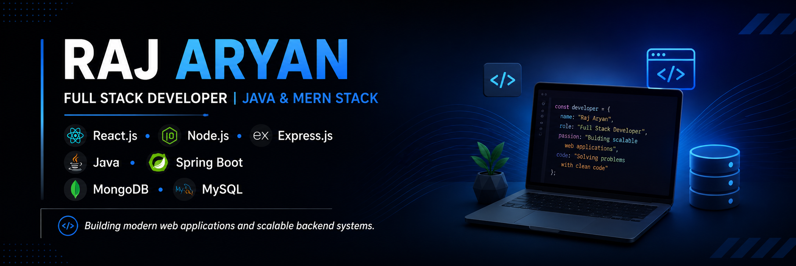

 

 Hi, I'm Raj Aryan 

🎓 B.Tech CSE Student at IILM University

💻 Full Stack Developer

🚀 React.js | Node.js | Express.js | Java | Spring Boot | MongoDB | MySQL

 B.Tech CSE Student at IILM University

 Full Stack Developer

Passionate about building scalable web applications using modern frontend and backend technologies.

 Technical Skills
 Frontend
- HTML5
- CSS3
- JavaScript (ES6+)
- React.js
- Responsive Web Design

 Backend
- Node.js
- Express.js
- Java
- Spring Boot
- REST APIs

Databases
- MongoDB
- MySQL
- SQL

 Tools & Technologies
- Git
- GitHub
- VS Code
- IntelliJ IDEA
- Maven
- Postman

Full Stack Development

Frontend:
- React.js
- HTML
- CSS
- JavaScript

Backend:
- Node.js
- Express.js
- Java
- Spring Boot
- REST APIs

Databases:
- MongoDB
- MySQL

 GitHub Stats

